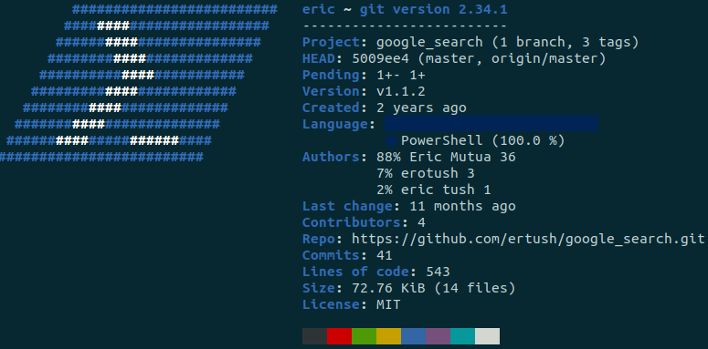

## Google_Search

[](https://github.com/ertush/google_search/actions/workflows/publish_powershell_gallery.yml)

[](https://github.com/ertush/google_search/actions/workflows/release.yml)

 Script module to use search engine and Open urls from powershell. Supports msedge and chrome among other browsers.
 You can also find the module from [PowershellGallery](https://www.powershellgallery.com/packages/google_search/1.1.2). Private browsing otherwise known as incognito mode is only currently supported in brave and chrome browsers by google_search_module. 

## Installation

  To install run ```Install-Module -Name google_search``` to update to the latest script module run
 ```Update-Module google_search```

To load the latest uptodate module automatically to your powershell or pwsh, add the following to (```$profile```) Microsoft.PowerShell_profile.ps1

 ```powershell
    function getLatestVerison() {
    Param(
        [Parameter(Mandatory=$true, Position=0)]
        [string]
        $module_name
    )
    $versions=@(cmd /c dir /O-N /b %USERPROFILE%\Documents\PowerShell\Modules\$module_name\);
    return $versions[0];
    }

    import-module ~\Documents\PowerShell\Modules\google_search\$(getLatestVerison -module_name "google_search")\google_search.psm1
```
## Dependecies

 None.

## Exported Functions

 * Open-Site
 * Search-Google
 * Search-DuckDuckGo
 * Search-Youtube
 * Search-Bing
